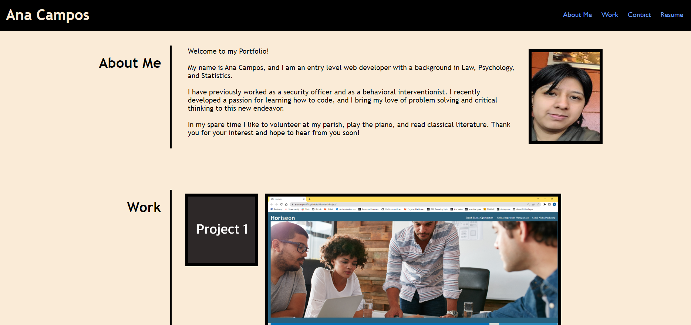

# Module 2 Project: Portfolio 

## Description

This project was created as a portfolio page to showcase my skills and talents to employers looking to fill open positions.

## Installation

N/A we don’t have any steps to take to install anything for our webpage

## Usage
 This portfolio includes: presentation of the developer's name, a recent photo or avatar, and links to sections about them, their work, and how to contact them.

When I click one of the links in the navigation the UI scrolls to the corresponding section. When I click on the link to the section about their work then the UI scrolls to a section with titled images of the developer's applications.

 When I click on the images of the applications I am then taken to that deployed application.

When I resize the page or view the site on various screens and devices I am presented with a responsive layout that adapts to my viewport.
Creation of the HTML and CSS files renders the following webpage

 
 
## Credits
Many Thanks to the UCR Coding Bootcamp Academic team and my wonderful classmates for supporting me through my coding journey!
## License

N/A
## Link to deployed application: 

https://anacampos171.github.io/Module-2-Challenge/
